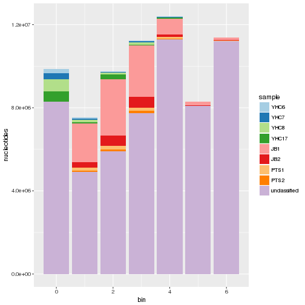

<style>
    body {
      background-image: url(images/twitter_handle.png), url(images/agrf_logo.jpg);
      background-position: top right, bottom right;
      background-repeat: no-repeat, no-repeat;
      background-attachment:fixed;
      background-size: 150px, 200px;
    }
    .section .reveal .state-background {
        background-image:  url(images/twitter_handle.png), url(images/agrf_logo.jpg);
        background-position: top right, bottom right;
        background-attachment: fixed;
        background-repeat: no-repeat;
        background-size: 150px, 200px;
    }
    img[alt=plasmid_1] { width: 250px; }
    img[alt=plasmid_2] { width: 250px; }
    img[alt=poreduck] { width: 100px; }
    img[alt=porechop] { width: 300px; }
    img[alt=pauvre] { width: 600px; }

</style>
    
Plasmid Assembly at the AGRF
========================================================
class: body
author: Alexis Lucattini
date: July, 2017
autosize: true

What can you hope to get out of this talk
========================================================
class: body
left: 60%

* Nanopore expectations with low input.
* What plasmids are and why they are useful.
* Applied examples of bioinformatic tools for Nanopore sequencing.
* Potential AGRF partnership with Nanopore sequencing.

*** 

#### List of tools used during this talk.

|Name      |Author       |Focus         |
|:---------|:------------|:-------------|
|Poreduck  |A. Lucattini |Data Handling |
|Albacore  |ONT          |Basecalling   |
|Porechop  |R. Wick      |Trimming      |
|Pauvre    |D. Schultz   |QC-plotting   |
|Canu      |S. Koren     |Assembly      |
|Circlator |M. Hunt      |Assembly      |


Plasmid Background
========================================================
left: 70%  
class: body

- Plasmids are small circular dsDNA sequences, found mainly in bacteria.  
- Bacteria can use plasmids to share genetic information, even between different species.  
- Genes on plasmids can encode for virulence factors or anti-microbial resistance. 
- But scientists can also use plasmids to clone, transfer or manipulate genes
  
***  


Traditional Plasmid Sequencing at the AGRF
========================================================
class: body

- Samples sequenced on MiSeq or Sanger.
- Sanger with multiple primers to 'hop' through genome
- MiSeq, huge coverage yet poor assembly.
- Potential market for plasmid length MinION reads.


Nanopore Yields: 
========================================================
### You only get out, what you put in (Nutri-grain et al.)

* High molecular weight DNA ( > 1µg) ==> High yields 5-10+ Gbs.
* Low yields in plasmid extraction, sequencing used as confirmation.
* But how low can one go and still achieve their desired outcome?
  * 500 ng?
  * ... 50 ng?

8 plasmids: 4 bigs, 4 smalls
========================================================


***
<small>
* Small plasmids retained through clean-ups better than large plasmids.
* Reasons unknown.
  * Higher quality DNA?
  * Smaller DNA less likely to break?
* Protocol instructs normalise to 700 ng?
* We have a small dilemma...
</small>

A handy workaround.
========================================================

### The problem 
* Highly unbalanced library.
* Can obtain equal sequencing by lowering all inputs
  * Only as good as your lowest yield.

***

### The solution
* Add the good samples once the bad samples have had a go...
* Can use real-time analysis to know when to add.


The real-time analysis pipeline. Part 1/6
=========================================================

<small>
Find me on Github.
[www.github.com/alexiswl/poreduck](www.github.com/alexiswl/poreduck)

Two main scripts:
* Transfer data to server and remove from laptop.
* Run albacore through SGE on server.

Both scripts run in real-time.  

***

#### Basic steps of Poreduck pipeline.
* transfer script zips up full read folders and uses Rsync to move folder to server.
* transfer script continues to run until MinKNOW has finished.
* albacore script will unzip and run through basecaller. Outputs a fastq file for each folder. Barcoding compatible.
* This run shows need for low-yield parameter. Zip every 100 fast5 files.
</small>

The real-time analysis pipeline. Part 2/6
=========================================================
#### 
<small>
* Removes both ligation and barcoding adapters from nanopore reads.
* Can also quality filter reads with 'unusual results'.
* Useful output summary.

***


The real-time analysis pipeline. Part 2/6
=========================================================
#### Road block:
* Large amount of unclassified reads.
* Potential library step issue.
  * DNA extraction? 
  * End-prep issue?
* Could still use for consensus?
</small>

***




The real-time analysis pipeline. Part 3/6
=========================================================

|Sample       |    Yield|
|:------------|--------:|
|JB1          |  8073511|
|JB2          |  1475418|
|PTS1         |   549940|
|PTS2         |   324648|
|unclassified | 57426941|
|YHC17        |   871441|
|YHC6         |   363154|
|YHC7         |   468044|
|YHC8         |   903629|


***

Lowest sample yield is 324648 bp for sample PTS2

* Is this data still useful?  
* We've got 200x coverage.
* What's the read length like?

The real-time analysis pipeline. Part 3/6
=========================================================

<div id="bg">
  
</div> 

***

### Introducing pauvre.
* Margin plot for sample YHC6.  
* We can use these plots to estimate the actual length of the plasmid.
  * Required parameter for Canu
* Documentation can be found on GitHub.


The real-time analysis pipeline. Part 4/6
=========================================================
### Assembly with Canu
* Now we have our genome length parameter let the assembly begin.

#### Example Canu assembly command

```bash
canu -d assemblies/barcode06/ -p YHC6 genomeSize=18k \
-nanopore-raw 
```
canu can also invoke your SGE.  
See the docs http://canu.readthedocs.io/en/latest/

The real-time analysis pipeline. Part 4/6
=========================================================
### When canu fails
* Canu gives quite verbose output and logs.
* In some cases, it may not produce any contigs at all.
* In our case Canu failed on two of the large plasmids.
* There can still be useful partial assemblies that we can examine.
* The `*.contigs.layout.tigInfo` file can give us a clue.


The real-time analysis pipeline. Part 5/6
=========================================================
### Use circulator to cut edges that may have exceeded.
Using circulator minimus2 we can circularise the assembly

```bash
circilator minimus2 <input.fasta> <output.prefix>
```


The real-time analysis pipeline. Part 6/6
=========================================================
### Realign to our circuarlised draft genome.
* Using samtools we can realign our trimmed reads to our draft genome.
* View alignment with IGV. 
* Does everything look right?

The validation process. Circularisation
=========================================================
* Circulariser logs. `circle_dir/sample.log`
  * Did the genome circularise?
  * Good indication of assembly process.
  
***


The validation process. Circularised Genome
=========================================================
<div id="bg">
  
</div> 

The validation process. Non-circularised Genome
=========================================================
<div id="bg">
  
</div> 

What about all the unclassified data?
=========================================================
* In this particular run there was a large amount of 
unclassified data. 
* Can we map it to our draft genomes for a greater consensus sequence?


With the help of hybrid assemblies:
========================================================
* Unicycler.


